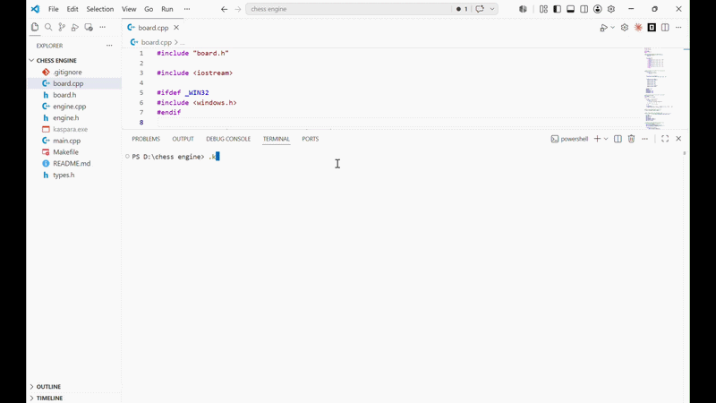

# Kaspara ♟️

<p align="center">
  
</p>

<p align="center">
  A C++ chess engine featuring Minimax, Alpha-Beta Pruning, and positional evaluation.
</p>

A terminal-based chess engine written in **C++** by **Mousam Kumawat**.

Kaspara was built to explore classical game AI concepts such as **Minimax**, **Alpha-Beta Pruning**, and **board evaluation techniques** while strengthening my understanding of algorithms, data structures, and systems programming.

## Features

- Complete legal chess move generation
- Castling, En Passant, and Pawn Promotion
- Minimax Search with Alpha-Beta Pruning
- Piece-Square Table Evaluation
- Human vs Engine Gameplay
- Search Statistics (Depth, Nodes, NPS)

## Build & Run

```bash
make
./kaspara
```

Or:

```bash
g++ -std=c++11 -O2 -o kaspara main.cpp board.cpp engine.cpp
./kaspara
```

## How to Play

Enter moves using UCI notation:

```text
e2e4
g1f3
e7e8q
```

For promotion:
- `q` = Queen
- `r` = Rook
- `b` = Bishop
- `n` = Knight

Type `quit` to exit.

## Concepts Demonstrated

- Data Structures & Algorithms
- Recursion
- Minimax Algorithm
- Alpha-Beta Pruning
- Game Tree Search
- Heuristic Evaluation
- Object-Oriented Programming

## Performance

- Search Depth: 4
- ~394,000 positions evaluated per second
- ~26,000 nodes evaluated per move at depth 4

## Future Improvements

- Iterative Deepening
- Transposition Tables
- Opening Book
- UCI Protocol Support
- Stronger Evaluation Function

## Author

**Mousam Kumawat**

Computer Science Engineering Student

LinkedIn: https://linkedin.com/in/mousam-kumawat

## License

MIT License

Copyright (c) 2026 Mousam Kumawat